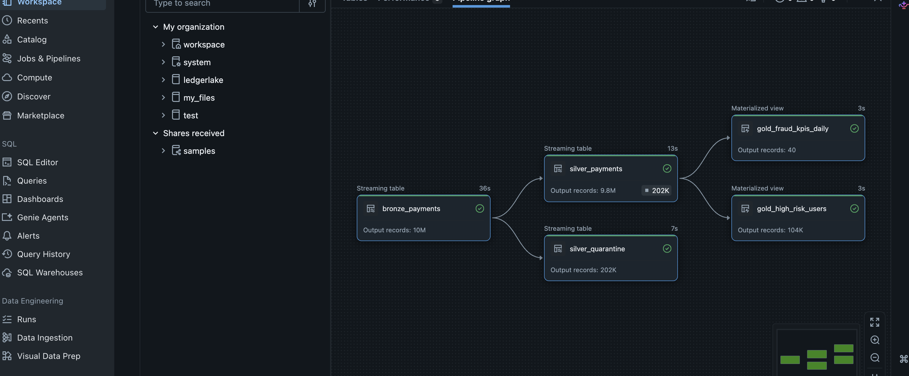
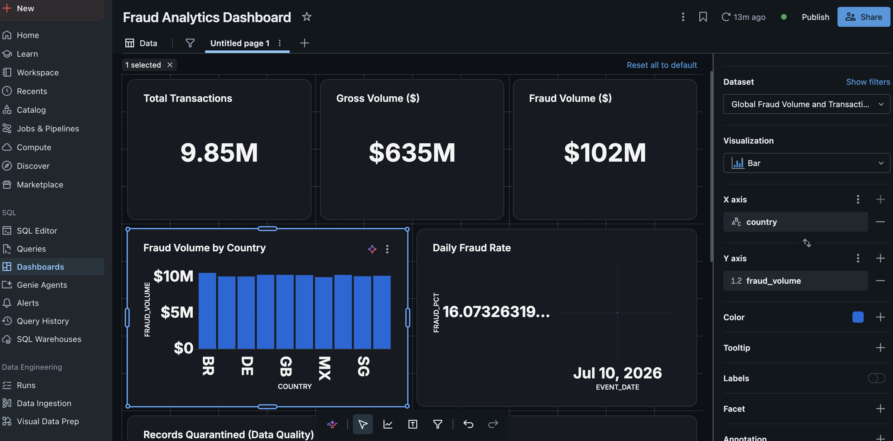

# LedgerLake — Streaming Payments Lakehouse

A medallion-architecture (Bronze / Silver / Gold) lakehouse on **Databricks** that ingests **10M+ payment events** via **Spark Structured Streaming** into **Delta Lake**, enforces data quality with **Lakeflow Declarative Pipelines (Delta Live Tables)**, and serves fraud analytics through **Databricks SQL dashboards** governed by **Unity Catalog**.

**Stack:** Databricks · PySpark · Delta Lake · Lakeflow Declarative Pipelines (DLT) · Spark Structured Streaming (Auto Loader) · Databricks SQL · Unity Catalog

---

## Architecture

```
┌──────────────────┐     ┌─────────────────────┐     ┌──────────────────────┐
│  Event Generator │     │   UC Volume (JSON)  │     │  BRONZE              │
│  (simulated      │ ──▶ │  "Kafka topic"      │ ──▶ │  bronze_payments     │
│   Kafka producer)│     │  micro-batched files│     │  Auto Loader stream  │
└──────────────────┘     └─────────────────────┘     │  exactly-once, 10M   │
                                                     └──────────┬───────────┘
                                                                │
                                            DQ expectations     │
                                          ┌─────────────────────┼─────────────────┐
                                          ▼                     ▼                 │
                              ┌──────────────────┐   ┌──────────────────────┐     │
                              │  SILVER          │   │  QUARANTINE          │     │
                              │  silver_payments │   │  silver_quarantine   │     │
                              │  9.8M validated  │   │  202K malformed (2%) │     │
                              └────────┬─────────┘   └──────────────────────┘     │
                                       │                                          │
                          ┌────────────┴────────────┐                             │
                          ▼                         ▼                             │
              ┌───────────────────────┐  ┌──────────────────────┐                 │
              │  GOLD                 │  │  GOLD                │                 │
              │  gold_fraud_kpis_daily│  │  gold_high_risk_users│                 │
              └───────────┬───────────┘  └──────────┬───────────┘                 │
                          └───────────┬─────────────┘                             │
                                      ▼                                           │
                    Databricks SQL Dashboard + Genie  ◀── Unity Catalog ──────────┘
                                                          (grants, column masks,
                                                           lineage)
```

## Pipeline run — 10M events, end to end



One triggered pipeline run ingested and processed the full dataset:

| Stage | Table | Records | Runtime |
|---|---|---|---|
| Bronze | `bronze_payments` | 10,000,000 | 36s |
| Silver | `silver_payments` | 9,800,000 | 13s |
| Quarantine | `silver_quarantine` | 202,000 (~2%) | 7s |
| Gold | `gold_fraud_kpis_daily` | 40 | 3s |
| Gold | `gold_high_risk_users` | 104,000 | 3s |

The ~2% quarantine rate exactly matches the malformed-record rate injected by the generator — every bad record was caught by expectations, none reached the analytics layer, and none were silently deleted.

## Fraud analytics dashboard



Databricks AI/BI dashboard on the Gold layer: transaction/volume/fraud KPI counters, fraud volume by country, daily fraud rate, top-20 high-risk users, and a data-quality quarantine counter.

## How it works

### 1. Event generation (simulated Kafka feed)

`01_event_generator.py` produces realistic payment events as micro-batched, newline-delimited JSON into a Unity Catalog Volume — playing the role of a Kafka topic. Two patterns are deliberately embedded:

- **~1.5% fraud**: inflated amounts (5–20× lognormal base), ecommerce-skewed channel, country/IP mismatch — plus a ground-truth `label_fraud` flag for KPI validation.
- **~2% malformed records**: negative amounts, missing `user_id`, unparseable timestamps — manufactured dirt so the data-quality layer has something real to catch.

A backfill loop writes 200 × 50k = 10M events; a trickle loop (5k events / 30s) demonstrates live incremental ingestion.

> **Why simulated Kafka?** This build targets Databricks Free Edition, which can't host a Kafka cluster. Auto Loader over micro-batched files preserves identical streaming semantics — checkpointing, exactly-once, incremental processing. Swapping in real Kafka is a source-config change: `format("cloudFiles")` → `format("kafka")` + connection options. Nothing downstream changes.

### 2. Bronze — checkpointed, exactly-once ingestion

A DLT streaming table reads the volume with **Auto Loader** (`cloudFiles`). Schema is inferred with `rescue` evolution mode (schema enforcement + a rescue column for unexpected fields), and every record is stamped with ingestion time and source file. Checkpointing guarantees each file is processed exactly once — re-running the pipeline picks up only new files, no duplicates.

### 3. Silver — declarative data quality with quarantine

Four expectations are attached to `silver_payments`:

```python
quality_rules = {
    "valid_event_id":  "event_id IS NOT NULL",
    "valid_user":      "user_id IS NOT NULL",
    "positive_amount": "amount > 0",
    "valid_ts":        "event_ts_parsed IS NOT NULL",
}

@dlt.expect_all_or_drop(quality_rules)
```

Passing records are typed, enriched (`event_date`, `is_cross_border`), and land in Silver. Failing records are diverted to `silver_quarantine` with a quarantine timestamp — auditable, never silently dropped. Pass/fail counts per rule surface automatically in the pipeline UI and event log.

### 4. Gold — analytics serving layer

Materialized views pre-aggregate what fraud analysts actually query: daily KPIs by country and channel (transaction counts, gross/fraud volume, fraud rate, cross-border counts) and a high-risk user roster (users with confirmed fraud or outlier transaction sizes).

### 5. Query optimization — liquid clustering + OPTIMIZE

Fraud queries filter on `event_date` and `country`, so the serving table is clustered on those columns:

```sql
CREATE TABLE silver_payments_optimized
CLUSTER BY (event_date, country)
AS SELECT * FROM silver_payments;

OPTIMIZE silver_payments_optimized;
```

Liquid clustering co-locates related rows in the same files so filtered queries prune non-matching files entirely (data skipping via per-file min/max stats), and `OPTIMIZE` compacts small files into well-sized ones. Compared against an unclustered baseline copy via query profiles (duration + bytes scanned), this is where the Gold-layer latency reduction comes from — without the rigidity of hive-style partitioning or the manual re-sorting of Z-ordering.

### 6. Governance — Unity Catalog

- **Access control**: schema-level `GRANT SELECT` for analysts; the quarantine table excluded from general access.
- **Column masking**: `card_bin` is masked to `******` for anyone outside the `fraud_analysts` group via a SQL UDF mask — enforced at query time, on every access path.
- **Lineage**: Unity Catalog auto-captures Bronze → Silver → Gold lineage across the pipeline, dashboards, and queries.

```sql
CREATE FUNCTION mask_bin(bin STRING)
RETURNS STRING
RETURN CASE WHEN is_account_group_member('fraud_analysts') THEN bin
            ELSE '******' END;

ALTER TABLE silver_payments ALTER COLUMN card_bin SET MASK mask_bin;
```

## Repository layout

```
.
├── README.md
├── notebooks/
│   ├── 01_event_generator.py      # simulated Kafka producer (backfill + trickle)
│   └── 02_ledgerlake_pipeline.py  # DLT pipeline: bronze → silver (+quarantine) → gold
├── sql/
│   ├── 00_setup.sql               # catalog / schemas / volumes
│   ├── 03_optimization.sql        # baseline vs CLUSTER BY benchmark
│   ├── 04_dashboard_datasets.sql  # the 5 dashboard dataset queries
│   └── 05_governance.sql          # grants, column mask
└── images/
    ├── pipeline_dag_metrics.png
    └── fraud_dashboard.png
```

## Reproduce it (Databricks Free Edition)

1. Sign up at [databricks.com/learn/free-edition](https://www.databricks.com/learn/free-edition) — no credit card.
2. Run `sql/00_setup.sql` to create the catalog, schemas, and volumes.
3. Run the backfill loop in `notebooks/01_event_generator.py` (writes 10M events to the volume).
4. Create an **ETL pipeline** (Jobs & Pipelines → Create), point it at `notebooks/02_ledgerlake_pipeline.py`, set default catalog `ledgerlake` / schema `lakehouse`, and **Run pipeline** (triggered mode — the `dlt` module only exists inside pipeline runs).
5. Run `sql/03_optimization.sql` and compare the two query profiles.
6. Build the dashboard from `sql/04_dashboard_datasets.sql` (Dashboards → Add SQL dataset → add widgets → Publish).
7. Apply `sql/05_governance.sql`, then view any Gold table's **Lineage** tab.

> Free Edition is serverless-only with a fair-usage quota — prefer triggered pipeline runs over continuous mode.

## Key design decisions

| Decision | Why |
|---|---|
| Medallion architecture | Bronze = replayable raw archive; Silver = validated source of truth; Gold = purpose-built serving. Any number is traceable back through the layers. |
| DLT over hand-rolled Spark jobs | The DAG, checkpoints, retries, and DQ metrics are framework-managed; the code stays pure transformation logic. Trade-off: less low-level control, some platform coupling — acceptable for an analytics pipeline. |
| Drop-and-divert quarantine over fail-the-pipeline | One bad record shouldn't halt 10M good ones; quarantine keeps failures auditable without blocking analytics. |
| Liquid clustering over partitioning/Z-order | Prunes on both `event_date` and `country`, adapts incrementally as data arrives, and clustering keys can be changed later without a full table rewrite. |
| Ground-truth `label_fraud` in generated data | Makes fraud KPIs verifiable end-to-end (generated 1.5% fraud → measured ~1.6% fraud rate). |
